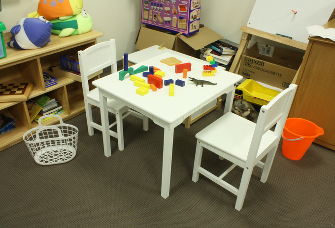
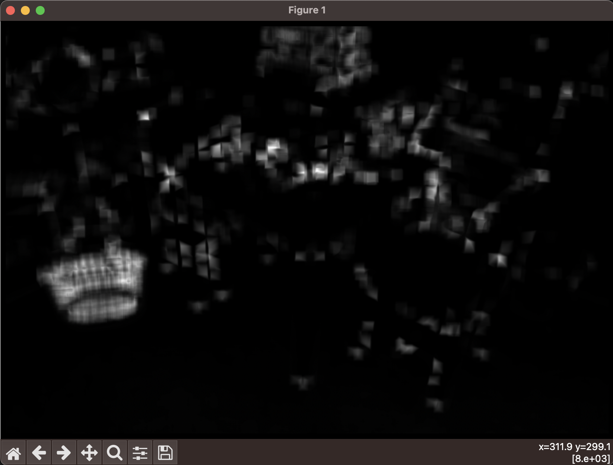
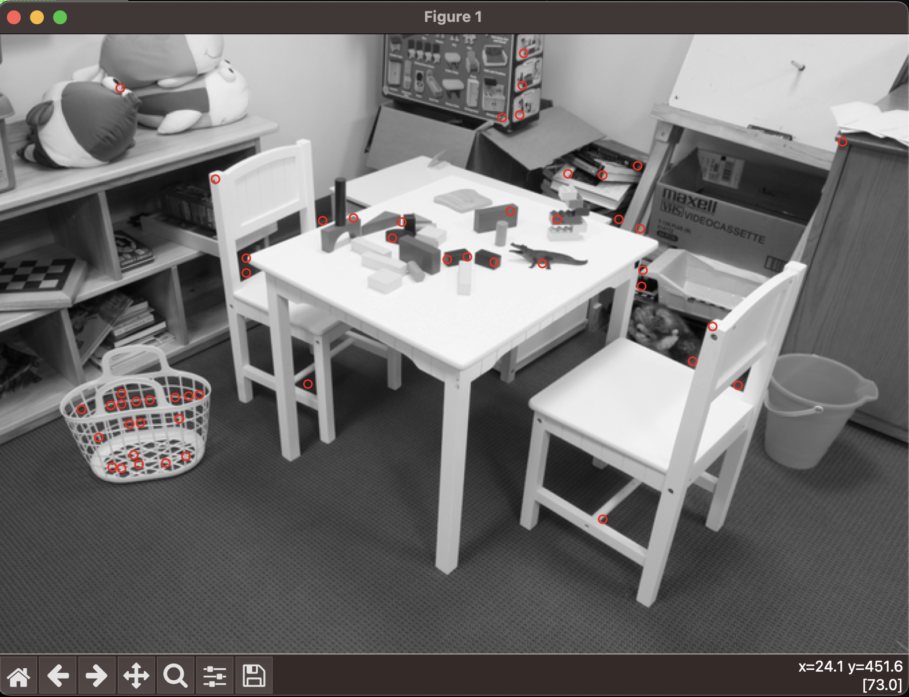

# panoramic
Create a panoramic image between two images, using basic Computer Vision Techniques.


## Installation

To run these games, you need to have Python installed on your system. Additionally, each game has its own set of dependencies which can be installed using `pip`.

```bash
pip install -r requirements.txt
```

## Usage

To create your own panoramic please change the config.ini file to have your images' paths to the file for image1 and image2.
Then run the `panoramic.py` file to generate a panoramic image of the two images. If the two images are not related, 
the code will throw an error saying the images cannot be made into a panoramic

## How it Works

### Corner detection

The first step in the code is a function that returns the corners in the individual images. For each image, a sobel operator is used to compute the gradient in the x and y directions of the image. Using these gradient images, we can create a second-moment matrix for each pixel around a fixed window. Finding the minimum eigenvalue of each second moment matrix, gives us an eigenimage of eigenvalues at each pixel.  

Example image:



#### Eigenvalues

The larger eigenvalues represent "corners" in the image where the gradient shows change in both the x and y direction. We use the eigenvalue to account for rotation in the corner, so it does not only detect upright corners. The Non-Maximum Suppression takes the eigenimage, and suppresses values near each other so only one eigenvalue is picked in a group of pixels near each other that have large eigenvalues. We then pick up the top n eigenvalues as corners in the image.

Example of Eigenimage:




#### Final corners





### SIFT Feature Matching
The SIFT algoirthm can take in key points, like the corners we find in the images and match them to corners in another image. It first creates a descriptor vector for each point, then uses euclidian distance to find the points with the least distance in the other image. Using a threshold we can keep the good matching points from image 1 to image 2.


